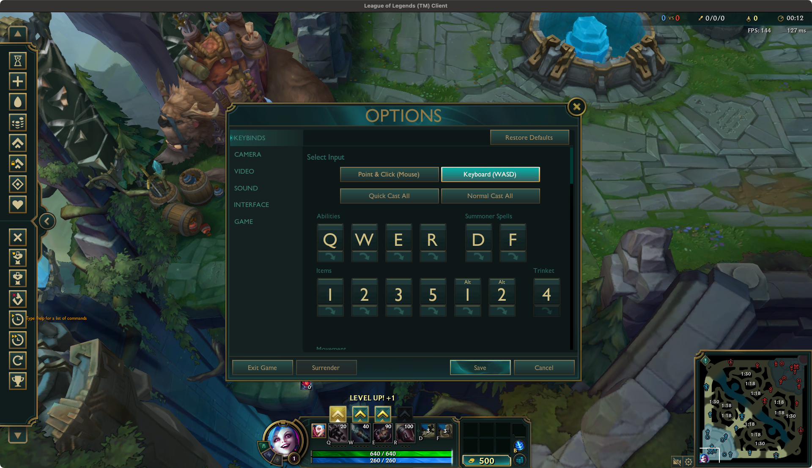

This project provides a set of config settings as a reference for those who want to play **League of Legends** on Windows or macOS using a D-pad with [the WASD keybinding](https://www.leagueoflegends.com/en-gb/news/dev/dev-wasd-controls-are-on-the-way/).

Refer to [**Wiki**](https://github.com/announce/lol-wasd/wiki) for more details.

