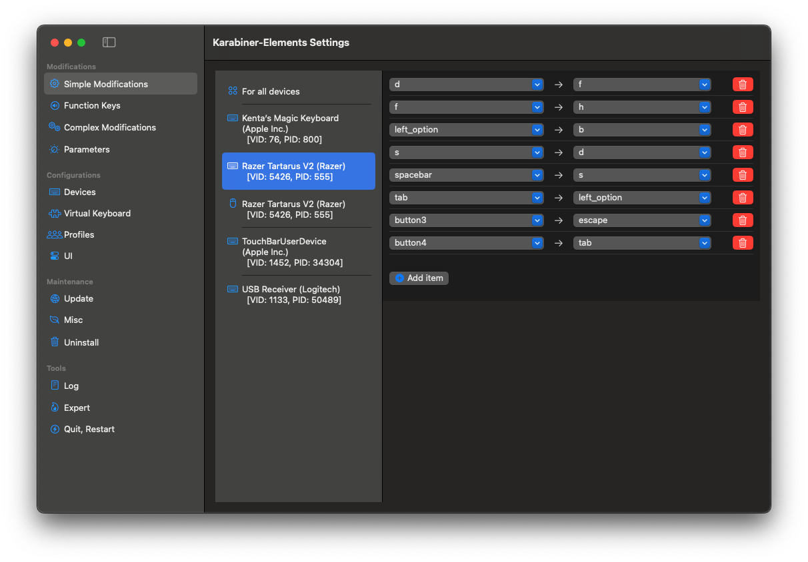

## Overview

Hello, oddballs!
This project provides a set of config settings as a reference for those who want to play **League of Legends** on macOS using a D-pad with [the WASD keybinding](https://www.leagueoflegends.com/en-gb/news/dev/dev-wasd-controls-are-on-the-way/).

Supported Device:

- [Razer Tartarus V2](https://www.razer.com/gaming-keypads/razer-tartarus-v2)


## Prerequisite

1. Install [Karabiner\-Elements](https://karabiner-elements.pqrs.org/) to remap the keybindings, since the official **Razer Synapse 2** no longer supports the latest macOS versions.



2. Optionally, sign up for [**PBE**](https://www.leagueoflegends.com/en-us/pbe/). At the time of writing, the WASD Keybinding is only available in PBE.


## How to edit the settings

Refer to [the official FAQ article](https://support-leagueoflegends.riotgames.com/hc/en-us/articles/115005433708-Hotkeys-Keybindings-FAQ) to find your local config directory. 

Then, locate an attribute named `WASD` under `Input.ini` in **PersistedSettings.json** and apply any desired changes.

Pitfall:

- With the WASD keybinding enabled, we no longer can specify `[Shift]` as a modifer key by design on the LoL client; however, the manual overwrite is still effective for now via the JSON file.


## Optional: How to unlock all the champions

For ease of verification, while it's completely optional, subscribe to [PC Game Pass](https://account.riotgames.com/xbox-game-pass-link/) and link your Riot account. It allows you to explore all the champions' interactions, including the obsqure [Champion Specific Interactions](https://wiki.leagueoflegends.com/en-us/Category:Champions_with_specific_interaction_hotkeys).

Note that, as of [Patch 25.20](https://www.leagueoflegends.com/en-us/news/game-updates/patch-25-20-notes/), the champions who are released after **K'Sante** need to be explicitly unlocked in PBE.


## For maintainers

#### Setup

Install the handy commands via [Homebrew](https://brew.sh/):

```shell
brew install rsync watch
```

#### How to take a snapshot of the config files

Run the command below:

```shell
watch -ebn 10 bash snapshot-settings.sh
```

It takes a snapshot of your local config files every 10 seconds.

#### Resource

- [Patch Schedule](https://support-leagueoflegends.riotgames.com/hc/en-us/articles/360018987893-Patch-Schedule-League-of-Legends)
- [PBE Changes](https://wiki.leagueoflegends.com/en-us/VPBE#League_of_Legends_VPBE)
